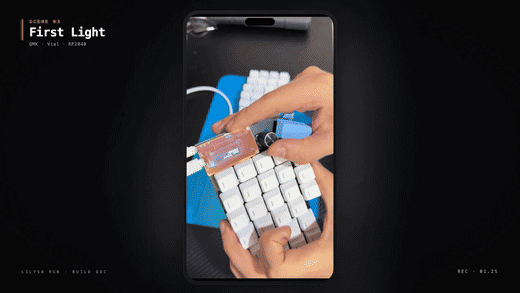

<div align="center">

# Lily58 RGB MX — Build Log

> *58 keys, hand-soldered, no regrets.*

Interactive build article for a hand-soldered Lily58 RGB MX split keyboard. Includes an animated keymap visualizer, embedded build video, and full build guide. Built with Vite, TypeScript, and GSAP.

[**Read →**](https://lily58.victorgalvez.dev)



[](LICENSE)
[](https://gsap.com)
[](https://vitejs.dev)
[](https://www.typescriptlang.org)

</div>

---

## Overview

A one-page article documenting the build of a [Lily58 RGB MX](https://pandakb.com) split keyboard from bare PCB to finished product. The page covers the bill of materials, 7-step build guide, common failure modes (LED chain orientation), and QMK + Vial firmware setup.

The centerpiece is a live interactive keyboard renderer that shows all 4 keymap layers — each key rendered from TypeScript data, switching layers with a staggered GSAP animation.

## Tech stack

| Layer | Tech |
|-------|------|
| Build | Vite 6 |
| Language | TypeScript 5.7 |
| Animation | GSAP 3.12 + ScrollTrigger |
| Typography | Lora (serif headings) + Inter |
| Keyboard renderer | Vanilla DOM, data-driven from `src/keymap.ts` |
| Deployment | Caddy static file server |

## Quick start

```bash
npm install
npm run dev       # dev server at http://localhost:5173
npm run build     # production build → dist/
npm run preview   # preview built output
```

## Project structure

```
.
├── src/
│   ├── main.ts       # GSAP animations + keyboard renderer + sound toggle
│   ├── keymap.ts     # Layer definitions — all 4 layers as typed data
│   └── style.css     # Design tokens + component styles
├── public/
│   ├── teaser.mp4    # Build video (rendered with Remotion)
│   └── teaser.gif    # Compressed version for README
└── docs/
    └── preview.gif   # README embed
```

## Keymap layers

All layers are defined in `src/keymap.ts` as typed `LayerData` objects. Switching layers triggers a GSAP stagger animation — keys fade out in random order, new keys fade in sequentially.

| # | Name | Purpose |
|---|------|---------|
| 0 | Default | QWERTY base with home-row mods |
| 1 | Symbols | Programming symbols, F-keys, numpad |
| 2 | Mouse + Media | Cursor, scroll, volume, media transport |
| 3 | Gaming | Flat WASD, right half inactive |

To add or modify a layer, edit the `LAYERS` array in `src/keymap.ts`. Key types (`mod`, `layer`, `fn`, `rgb`, `empty`) map to CSS classes for color-coding.

## Scroll animations

Every section animates in on scroll via `ScrollTrigger`. Sections use `gsap.set()` to initialize invisible + offset, then `gsap.to()` with a `scrollTrigger` to play on entry. The keymap section uses a timeline with staggered reveals for the tabs, caption, keyboard, and legend.

## Contributing

PRs welcome — the codebase is ~400 lines total.

1. **Fork → clone → branch** (`git checkout -b feat/your-thing`)
2. `npm run dev` to start
3. One change per PR — keep diffs readable
4. No formatting-only commits mixed with logic changes

### Good first issues

- Add a 5th layer (Navigation / arrow keys)
- Add keyboard half toggle (show only left or right half)
- Animate the layer caption text change (currently instant)
- Mobile: add swipe gesture to switch layers
- Add a "copy keymap as QMK JSON" button

## Acknowledgments

Build video produced with [Remotion](https://remotion.dev). Source footage from the original ~2h build session compressed to a ~22s teaser using custom Remotion compositions.
